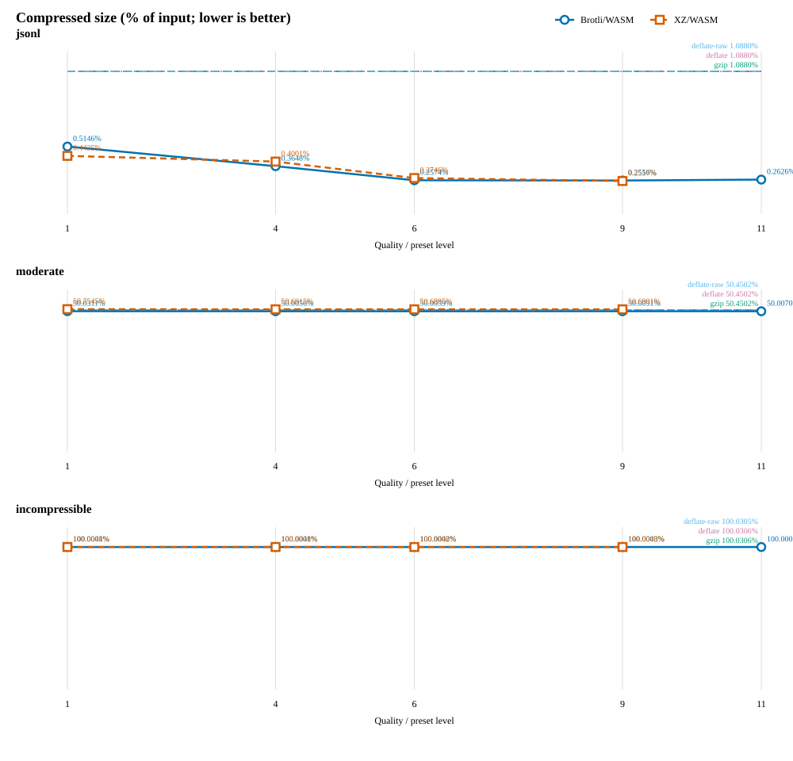
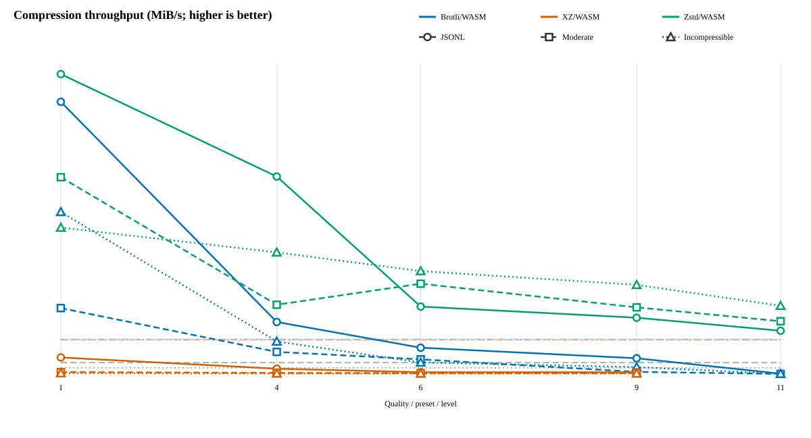
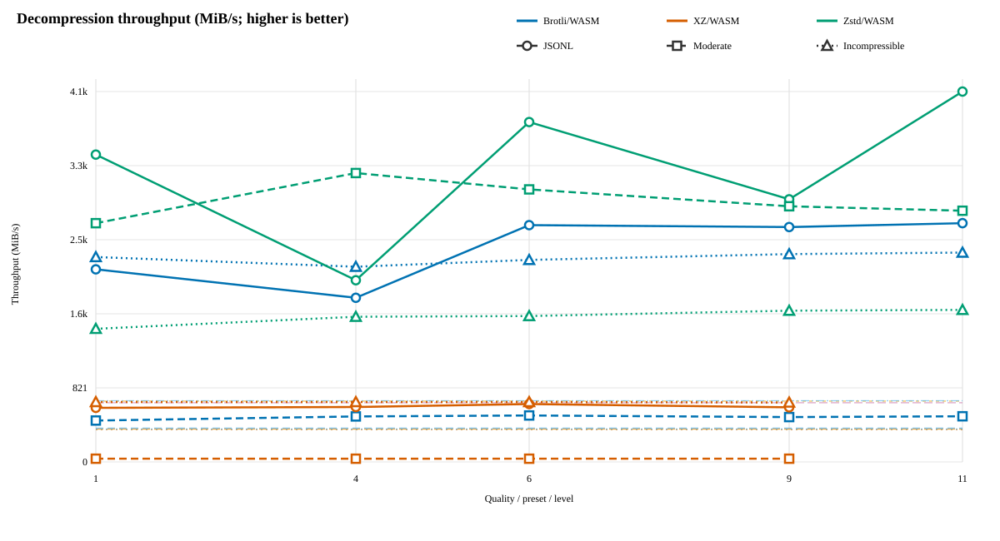

# Browser compression and Brotli/WASM vs XZ/WASM

This report compares codecs in the same headless Chrome process on the same deterministic corpora.  Each measured result follows one warm-up and uses the median of three measured repetitions.  Every measured codec is decompressed and checked byte-for-byte against its source on every run.

## Environment

- Browser: Mozilla/5.0 (X11; Linux x86_64) AppleWebKit/537.36 (KHTML, like Gecko) HeadlessChrome/153.0.0.0 Safari/537.36
- CPU: AMD EPYC 7763 64-Core Processor
- Logical CPUs: 4
- Corpus size: 32.00 MiB each
- Repetitions: 3 measured after 1 warm-up
- XZ: lzma-wasm 1.0.7 WebAssembly, presets 1, 4, 6, 9, binary 192.8 KiB
- Brotli: Google Brotli WebAssembly, qualities 1, 4, 6, 9, 11, binary 778.0 KiB

### WebAssembly payload size

| Implementation | WASM bytes | KiB |
|---|---:|---:|
| Brotli/WASM | 796,677 | 778.0 |
| XZ/WASM | 197,376 | 192.8 |

## Browser codec support

Support is runtime-detected in the browser named above.  An unsupported entry means that this browser rejects the corresponding `CompressionStream` / `DecompressionStream` format; it does not mean the compression algorithm is absent from the browser's HTTP stack.

- Supported: `gzip`
- Supported: `deflate`
- Supported: `deflate-raw`
- Unsupported: `brotli`
- Unsupported: `zstd`

## Graphs

### Compression ability

### Compression speed

### Decompression speed

The complete generated report, charts, and raw measurements are from GitHub Actions run 36521981417, commit 442152820809a8d8aec5a1e2e951656130b3c90c.
